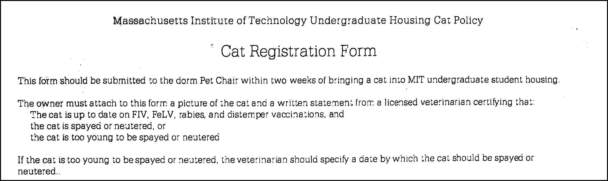
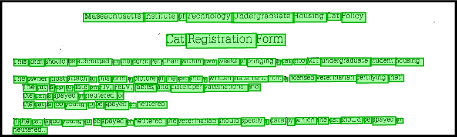
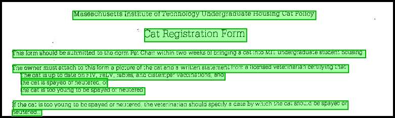

# Coalbox

_coal_ &bull; _box_ &mdash; coalesce boxes.

The [Sight API](https://siftrics.com/) is a text recognition service. It provides word-level bounding boxes in response to uploaded PDF documents and images.

This repository provides a Go library of bounding box coalescence algorithms: it is a toolkit of functions which take word-level bounding boxes as input and return coalesced &mdash; e.g., sentence-level or paragraph-level &mdash; bounding boxes.

Take, for example, this image:

<p align="center">
    
</p>

Here is the same image with word-level bounding boxes drawn on top:

<p align="center">
    
</p>

After coalescing at the sentence-level...

```
import "github.com/siftrics/coalbox"

...

sentences := coalbox.ToSentences(boundingBoxes)
```

...the bounding boxes are much easier to work with:


<p align="center">
    
</p>

# Apache v2 License

This repository is licensed under the Apache License, Version 2.0. You can view the full text of the license in the file named "LICENSE".
